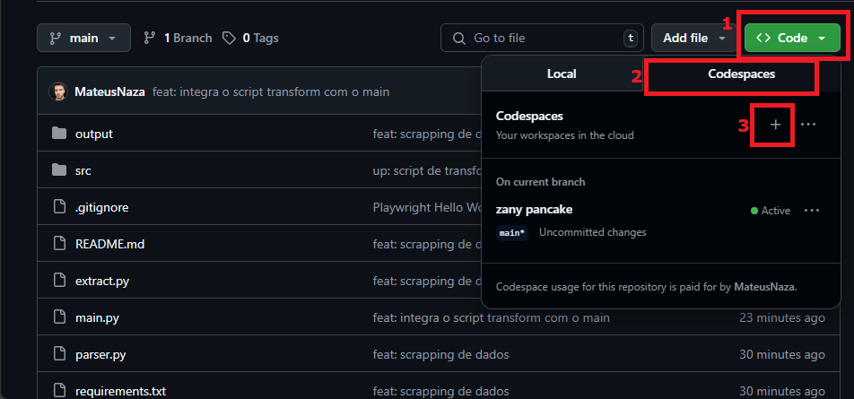

# web-automation
         
Esse projeto extrai dados de resultados de jogos de campeonatos de futebol atravéz de Web Scrapping, ele pega desde a rodada atual até a primeira rodada do campeonato, criando assim uma base de dados histórica.          
             
               
## Execução
         
Para execução recomendo utilizar o próprio Codespace do Gihub, seguindo os passos abaixo.    
         


Já no ambiente de desenvolvimento basta abrir o terminal integrado e seguir os seguintes comandos:     
            
```bash
# Cria ambiente virtual python
python -m venv .venv

# Inicia ambiente no linux
source .venv/bin/activate

# Instala as bibliotecas necessárias
pip install -r requirements.txt

# instala o playwright e suas dependencias (utilizado para navegar pelo site e efetuar o scrapping de dados)
playwright install
playwright install-deps

# Roda o script principal
python main.py
```
        
Após finalizar a execução basta acessar a pasta output, que deverá estar armazenando o arquivo 'tabela.csv', com os dados já tratados e prontos para serem consumidos.